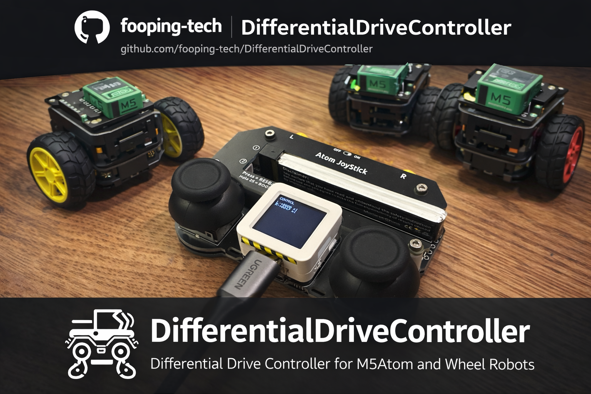

# DifferentialDriveController (差動二輪ロボット用コントローラ)

本プロジェクトはM5AtomS3 + AtomJoyを使い、USBシリアル経由でPCに左右タイヤの指示値を送る差動二輪ロボット用コントローラです。左右スティックYで左右タイヤを独立操作します。

## 仕様

- 左スティックY -> 左タイヤ指示値
- 右スティックY -> 右タイヤ指示値
- 前に倒すと正（前進）、後ろに倒すと負（後退）
- 送信フォーマット: `L:<value>,R:<value>\n`
- `value` 範囲: 通常は `-1000` 〜 `1000`
- Lボタン押下中は左のみ `-2000` 〜 `2000` に拡張
- Rボタン押下中は右のみ `-2000` 〜 `2000` に拡張
- デッドゾーン: `-40` 〜 `40` は `0` として送信
- 起動直後はキャリブレーションモードで、左右スティックをフルで回転させた後に手を離して0点補正（500ms静止）すると制御モードに移行
- 画面（本体ボタン）を押すと、いつでもキャリブレーションモードに戻る

## 使い方

1. USBケーブルでM5AtomS3をPCに接続します。
2. ビルド・書き込みを行います。
3. 画面の指示に従ってスティックをフルで回転させた後、手を離して0点補正を完了すると制御モードへ移行します。
4. 必要なら画面（本体ボタン）を押してキャリブレーションをやり直します。
5. シリアルモニタで出力を確認します。

コマンド例（リポジトリ直下）:

    pio run -e m5stack-atoms3
    pio run -t upload -e m5stack-atoms3
    pio device monitor -e m5stack-atoms3

シリアル出力例:

    L:0,R:0
    L:250,R:240
    L:-300,R:-310

## Framework

PlatformIO

## Base on project

[M5Fly-kanazawa/AtomJoy2024June (github.com)](https://github.com/M5Fly-kanazawa/AtomJoy2024June)

## Third-party libraries

m5stack/M5GFX @ ^0.1.16

fastled/FastLED @ ^3.7.0

M5AtomS3 @ ^0.0.3
